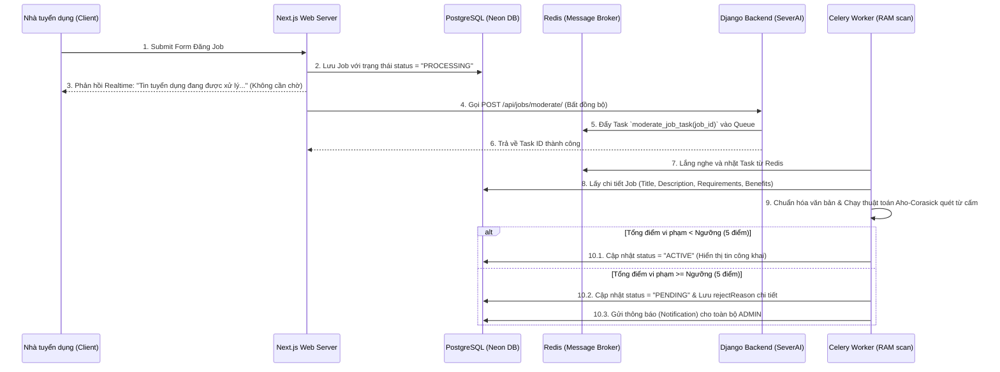

# Hệ Thống Tự Động Duyệt Tin Tuyển Dụng (Auto-Moderation System)

Hệ thống này được thiết kế để tự động kiểm duyệt nội dung tin tuyển dụng (Job) được đăng bởi doanh nghiệp nhằm ngăn chặn các hành vi lừa đảo, đa cấp, cá độ, hoặc nội dung vi phạm pháp luật trước khi hiển thị công khai trên nền tảng.

---

## 1. Kiến Trúc và Luồng Hoạt Động (Architecture Flow)

Hệ thống hoạt động theo mô hình bất đồng bộ (Asynchronous Task Queue) kết hợp giữa **Next.js**, **Django (SeverAI)**, **Redis (Broker)**, **Celery (Worker)** và cơ sở dữ liệu **PostgreSQL**.



---

## 2. Chi Tiết Trạng Thái Job (Job Status)

Hệ thống sử dụng enum `JobStatus` trong database với luồng chuyển đổi trạng thái như sau:
- **DRAFT**: Tin nháp của doanh nghiệp (không kiểm duyệt cho đến khi xuất bản).
- **PROCESSING**: Trạng thái trung gian khi tin vừa được tạo và đang trong hàng đợi xử lý của Celery.
- **ACTIVE**: Tin đã vượt qua vòng kiểm duyệt tự động và được hiển thị công khai.
- **PENDING**: Tin bị nghi ngờ vi phạm (điểm vi phạm $\ge 5$), cần Admin phê duyệt thủ công.
- **REJECTED**: Tin bị từ chối (bởi Admin).

---

## 3. Cơ Chế Kiểm Duyệt Tự Động (Auto-Moderation Engine)

### 3.1. Chuẩn Hóa Văn Bản (Normalization)
Để chống lại các thủ thuật "lách luật" như cố tình viết cách chữ (`l_ừ_a_đ_ả_o`, `l ư a đ a o`), hệ thống thực hiện chuẩn hóa văn bản qua 2 bước:
1. **Dạng chuẩn hóa thường (`normalized_text`)**: Chuyển thành chữ thường, loại bỏ các ký tự đặc biệt, emoji, dấu câu và rút gọn khoảng trắng thừa.
2. **Dạng loại bỏ khoảng trắng (`stripped_text`)**: Xóa toàn bộ khoảng trắng để so khớp trực tiếp với các từ cấm dạng viết liền.

### 3.2. Thuật Toán Tìm Kiếm Đa Mẫu Aho-Corasick
Thay vì duyệt qua danh sách từ cấm bằng hàng chục vòng lặp Regex hoặc `contains` (tốn chi phí hiệu năng cực kỳ lớn), hệ thống xây dựng một **cây Trie mẫu** kết hợp **liên kết thất bại (failure links)** trên RAM:
- **Thời gian tìm kiếm**: Chỉ mất đúng **một lượt quét văn bản duy nhất** với độ phức tạp thời gian cực kỳ tối ưu là $O(N)$ (trong đó $N$ là chiều dài văn bản cần quét).
- **Dung lượng RAM tối ưu**: Việc dựng cây Trie Aho-Corasick được thực hiện một lần trên mỗi task hoặc cache trực tiếp, giúp xử lý hàng ngàn tin tuyển dụng mỗi giây dễ dàng.

### 3.3. Hệ Thống Tính Điểm Vi Phạm (Violation Scoring)
Mỗi từ cấm sẽ đi kèm một điểm số phạt tương ứng tùy mức độ nghiêm trọng:
- **Cờ bạc, mại dâm, lừa đảo nặng (5đ)**: `cá độ`, `cờ bạc`, `tài xỉu`, `lừa đảo`, `đa cấp`, `mại dâm`, `sex`...
- **Dịch vụ nhạy cảm, cho vay (4đ - 5đ)**: `cho vay nặng lãi`, `tín dụng đen`, `tuyen pg nhay cam`...
- **Nghi vấn tuyển dụng ảo (2đ - 3đ)**: `việc nhẹ lương cao` (5đ), `kiếm tiền nhanh` (4đ), `không cần kinh nghiệm` (2đ)...

> [!IMPORTANT]
> **Ngưỡng tự động duyệt (Threshold): 5 điểm**
> - Nếu tổng điểm vi phạm **< 5**: Job được tự động phê duyệt thành `ACTIVE`.
> - Nếu tổng điểm vi phạm **>= 5**: Job bị giữ lại ở trạng thái `PENDING`, ghi nhận lý do chi tiết vào trường `rejectReason` và thông báo cho ban quản trị.

---

## 4. Phân Hệ Thông Báo Admin (Admin Notification System)

Khi một tin tuyển dụng bị đánh dấu là vi phạm từ khóa và chuyển về `PENDING`:
1. Hệ thống tự động truy vấn danh sách người dùng có quyền `role = 'ADMIN'`.
2. Tạo bản ghi thông báo loại `SYSTEM` vào bảng `notifications`.
3. Admin sẽ nhận được thông báo ngay lập tức trên dashboard với nội dung chi tiết:
   > *"Doanh nghiệp X vừa đăng tin tuyển dụng mới: Y và đang chờ phê duyệt do vi phạm từ khóa."*
4. Admin có thể xem chi tiết lý do vi phạm (`rejectReason`), các từ khóa bị bắt được cùng điểm số phạt tương ứng để đưa ra quyết định phê duyệt cuối cùng.

---

## 5. Hướng Dẫn Vận Hành và Giám Sát

### 5.1. Khởi Động Bằng Docker Compose
Hệ thống vận hành song hành 3 dịch vụ chính trong môi trường Docker:
```bash
# Di chuyển đến thư mục backend Django (SeverAI)
cd SeverAI

# Khởi động dịch vụ (Redis, Django Server, Celery Worker)
docker-compose up -d --build
```

### 5.2. Giám Sát Logs Kiểm Duyệt Realtime
Để xem tiến trình quét từ cấm của Celery Worker:
```bash
docker logs -f recruitment_celery
```

Các log kiểm duyệt mẫu hiển thị trong terminal:
```text
[2026-06-12 11:45:00] INFO/ForkPoolWorker-1: moderate_job_task[task-uuid] started.
[2026-06-12 11:45:01] INFO/ForkPoolWorker-1: Moderation finished for job clx123456. Status: PENDING, Score: 10, Detected: lừa đảo (5đ), việc nhẹ lương cao (5đ)
```
