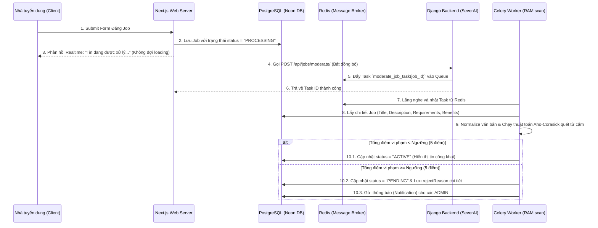

# Hướng Dẫn Vận Hành Hệ Thống Kiểm Duyệt Job Bằng Docker (Celery + Redis + Aho-Corasick)

Tài liệu này ghi lại toàn bộ cấu trúc và cách chạy hệ thống kiểm duyệt tin tuyển dụng (Job) tự động và bất đồng bộ bằng **Docker**.

---

## 1. Sơ Đồ Kiến Trúc Hệ Thống (Workflow)



---

## 2. Cấu Hình Docker Compose Cho Hệ Thống

Để chạy toàn bộ hạ tầng (Redis, Celery, Django) bằng Docker một cách nhanh nhất, bạn có thể tạo một file `docker-compose.yml` tại thư mục gốc của dự án `SeverAI`:

### [NEW] `docker-compose.yml` (Đặt tại thư mục `SeverAI/docker-compose.yml`)

```yaml
version: '3.8'

services:
  # 1. Redis Broker làm nhiệm vụ điều phối hàng đợi task
  redis:
    image: redis:alpine
    container_name: recruitment_redis
    ports:
      - "6379:6379"
    restart: always

  # 2. Django Server chạy các API endpoint nhận request từ Next.js
  django:
    build: .
    container_name: recruitment_django
    command: python manage.py runserver 0.0.0.0:8000
    volumes:
      - .:/app
    ports:
      - "8000:8000"
    env_file:
      - .env
    depends_on:
      - redis
    restart: always

  # 3. Celery Worker chạy ngầm để kiểm duyệt Job bằng thuật toán Aho-Corasick
  celery_worker:
    build: .
    container_name: recruitment_celery
    command: celery -A job_recommender worker --loglevel=info
    volumes:
      - .:/app
    env_file:
      - .env
    depends_on:
      - redis
      - django
    restart: always
```

> **Lưu ý**: Để chạy được Docker Compose trên, bạn cần tạo thêm một `Dockerfile` cơ bản trong thư mục `SeverAI` nếu chưa có:
> ```dockerfile
> FROM python:3.10-slim
> WORKDIR /app
> COPY requirements.txt .
> RUN pip install --no-cache-dir -r requirements.txt
> COPY . .
> ```

---

## 3. Các Lệnh Vận Hành Bằng Docker

Mở Terminal tại thư mục `SeverAI` và thực hiện các lệnh sau:

### Lệnh 3.1: Khởi động toàn bộ các dịch vụ (Redis, Django, Celery Worker)
Chạy lệnh này để build image và chạy ngầm toàn bộ container:
```bash
docker-compose up -d --build
```

### Lệnh 3.2: Xem Log của Celery Worker
Để kiểm tra Celery có nhặt được Task và in kết quả quét Aho-Corasick hay không:
```bash
docker logs -f recruitment_celery
```

### Lệnh 3.3: Dừng toàn bộ hệ thống container
```bash
docker-compose down
```

---

## 4. Chi Tiết Thuật Toán Lọc & Kiểm Duyệt (Aho-Corasick)

Hệ thống lọc tích hợp trong [tasks.py](file:///c:/Users/ngoan/Documents/doanthu/SeverAI/api/tasks.py) xử lý theo 3 bước tối ưu:

1. **Chuẩn Hóa (Normalize)**: 
   - Tiêu đề + Nội dung Job được gom lại thành văn bản chữ thường.
   - Xóa bỏ toàn bộ ký tự đặc biệt, emoji, dấu câu.
   - Tạo ra 2 phiên bản văn bản: Bản chuẩn có khoảng trắng (`normalized_text`) và Bản xóa sạch khoảng trắng (`stripped_text`). Bản không khoảng trắng dùng để phát hiện các từ cố tình lách luật như `l_ừ_a_đ_ả_o` hoặc `l ư a đ a o` $\rightarrow$ `luađao`.
2. **Xây Cây Từ Điển Aho-Corasick**:
   - Dựng cấu trúc cây Trie và liên kết thất bại (failure link) trên RAM cho danh sách từ khóa cấm.
   - Tìm kiếm đồng thời tất cả các từ khóa vi phạm chỉ bằng **một lượt đọc văn bản duy nhất** ($O(N)$), tối ưu hơn rất nhiều so với dùng hàng chục vòng lặp regex `.search()`.
3. **Cộng Điểm & Cập Nhật**:
   - Mỗi từ cấm chỉ cộng điểm 1 lần duy nhất.
   - Đối chiếu với ngưỡng (Threshold = 5). Nếu vượt ngưỡng, tự động chuyển Job về trạng thái `PENDING` và gửi cảnh báo về Dashboard của Admin, ngược lại tự động duyệt thành `ACTIVE`.
