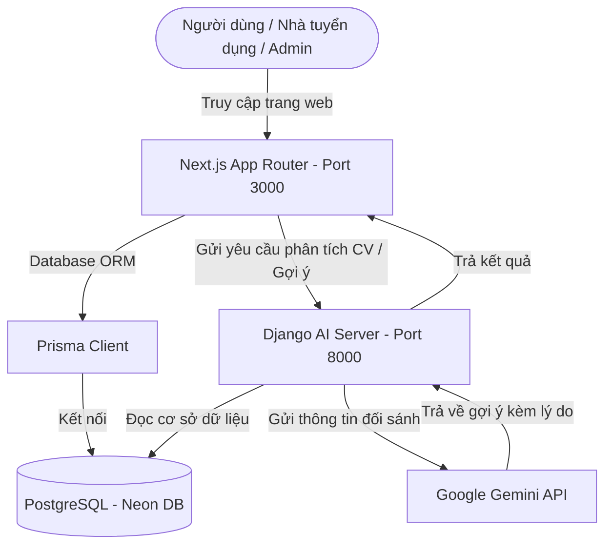

# Hệ thống Tìm kiếm và Gợi ý Việc làm Phú Quốc (Phu Quoc Jobs)

Chào mừng bạn đến với dự án **Phu Quoc Jobs** - Hệ thống tuyển dụng thông minh được tích hợp trí tuệ nhân tạo (AI) giúp kết nối nhà tuyển dụng và ứng viên tại Phú Quốc.

Dự án gồm 2 phần chính:
1. **Frontend & Backend Management (Next.js)**: Nền tảng web quản lý quy trình ứng tuyển, đăng tin, duyệt hồ sơ, nhắn tin thời gian thực và quản trị hệ thống.
2. **AI Recommender Server (Django)**: Máy chủ phân tích CV (PDF/Text) bằng thuật toán TF-IDF kết hợp mô hình AI **Gemini 2.5 Flash** để tìm và đề xuất công việc phù hợp kèm lý do thuyết phục cho ứng viên.

---

## 🏗️ Kiến trúc hệ thống (Architecture)



---

## 🛠️ Công nghệ sử dụng (Tech Stack)

### 1. Nền tảng quản lý (Thư mục `recruitment-platform`)
* **Framework**: Next.js 15+ (App Router), React 19
* **Database Access**: Prisma ORM
* **Database**: PostgreSQL (Hosted on Neon serverless)
* **Styling**: TailwindCSS / Vanilla CSS
* **Xác thực**: JSON Web Tokens (JWT) lưu trữ an toàn trong HttpOnly Cookie
* **Lưu trữ hình ảnh**: Cloudinary API (Lưu trữ Logo doanh nghiệp)

### 2. Máy chủ AI (Thư mục `severAI`)
* **Framework**: Django, Django REST Framework
* **Ngôn ngữ**: Python 3.12
* **Xử lý dữ liệu**: `pandas`, `numpy`, `scikit-learn` (Thuật toán TF-IDF & Cosine Similarity)
* **Xử lý tệp tin**: `pypdf` (Đọc nội dung từ file CV PDF)
* **Trí tuệ nhân tạo**: Google Gemini API (`gemini-2.5-flash`)

---

## 🌟 Các chức năng chính (Key Features)

### 👤 Dành cho Ứng viên (Candidate)
* Đăng ký, đăng nhập tài khoản và tạo/quản lý Hồ sơ CV trực tuyến.
* Tìm kiếm việc làm linh hoạt theo tên, ngành nghề, địa điểm (Phú Quốc), mức lương và kinh nghiệm.
* **Đề xuất việc làm bằng AI**: Tải lên file CV định dạng PDF để nhận ngay 3 công việc phù hợp nhất kèm giải thích lý do từ AI.
* Quản lý đơn ứng tuyển, nhận lịch phỏng vấn và phản hồi đồng ý/từ chối lịch phỏng vấn.
* Trò chuyện nhắn tin thời gian thực với nhà tuyển dụng khi đơn ứng tuyển được duyệt.
* Nhận thông báo tức thì (Thông báo tin nhắn, Đơn ứng tuyển thay đổi trạng thái).

### 🏢 Dành cho Nhà tuyển dụng (Employer)
* Đăng ký thông tin doanh nghiệp (chờ Admin duyệt).
* Đăng tin tuyển dụng mới ở dạng Nháp (Draft) hoặc Chờ duyệt (Pending).
* Quản lý danh sách đơn ứng tuyển của các ứng viên, xem trước CV PDF trực tuyến bằng công cụ render tùy chỉnh.
* Duyệt/từ chối ứng viên. Khi duyệt sẽ tự động kích hoạt phòng chat riêng với ứng viên đó.
* Lên lịch phỏng vấn (Online/Offline) và gửi thông báo trực tiếp đến ứng viên.

### 🛡️ Dành cho Quản trị viên (Admin)
* Thống kê tổng quan (Dashboard) số lượng người dùng, tin tuyển dụng, doanh nghiệp, CV.
* Kiểm duyệt và phê duyệt trạng thái hoạt động của doanh nghiệp đăng ký mới.
* Kiểm duyệt bài đăng tuyển dụng của nhà tuyển dụng.
* Khóa/mở khóa tài khoản người dùng vi phạm quy tắc. Khi tài khoản bị khóa, mọi phiên đăng nhập của người dùng đó sẽ lập tức bị hủy bỏ và từ chối.
* Nhận thông báo thời gian thực trên thanh Header khi có doanh nghiệp mới đăng ký hoặc tin tuyển dụng mới chờ duyệt.
* Hỗ trợ giải quyết thắc mắc qua khung chat hỗ trợ.

---

## 🚀 Hướng dẫn cài đặt & Chạy dưới local (Installation & Setup)

### 1. Cấu hình & Chạy Recruitment Platform (Next.js)

Di chuyển vào thư mục dự án Next.js:
```bash
cd recruitment-platform
```

Cài đặt các thư viện Node.js:
```bash
npm install
```

Tạo file `.env` trong thư mục `recruitment-platform/` và cấu hình các biến sau:
```env
DATABASE_URL="postgresql://neondb_owner:npg_... (URL PostgreSQL của bạn)"
JWT_SECRET="chuoi-bi-mat-tuy-chinh-cua-ban"

CLOUDINARY_CLOUD_NAME="your_cloud_name"
CLOUDINARY_API_KEY="your_api_key"
CLOUDINARY_API_SECRET="your_api_secret"
NEXT_PUBLIC_USE_CLOUDINARY=true
```

Đồng bộ cấu trúc Database Prisma và khởi chạy môi trường dev:
```bash
npx prisma db push
npm run dev
```
Mở [http://localhost:3000](http://localhost:3000) trên trình duyệt.

---

### 2. Cấu hình & Chạy Server AI (Django)

Di chuyển vào thư mục AI Server:
```bash
cd severAI
```

Kích hoạt môi trường ảo Python:
* **Windows**:
  ```powershell
  .\env\Scripts\activate
  ```
* **macOS/Linux**:
  ```bash
  source env/bin/activate
  ```

Cài đặt các gói thư viện Python:
```bash
pip install -r requirements.txt
```
*(Nếu chưa có file requirements.txt, hãy chạy `pip install django djangorestframework dj-database-url python-dotenv requests pandas numpy scikit-learn pypdf psycopg2-binary`)*

Tạo file `.env` trong thư mục `severAI/` và cấu hình các biến sau:
```env
DATABASE_URL="postgresql://neondb_owner:npg_... (Dùng chung database với Next.js)"
GEMINI_API_KEY="your_gemini_api_key_starts_with_AIzaSy..."
```

Chạy máy chủ Django:
```bash
python manage.py runserver
```
Máy chủ AI sẽ chạy tại [http://127.0.0.1:8000](http://127.0.0.1:8000).
