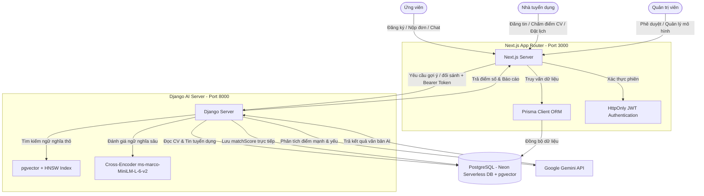

# HỆ THỐNG TUYỂN DỤNG VÀ GỢI Ý VIỆC LÀM THÔNG MINH PHÚ QUỐC (PHU QUOC JOBS)

Chào mừng bạn đến với tài liệu giới thiệu hệ thống, hướng dẫn vận hành và sơ đồ nghiệp vụ của toàn bộ dự án **Phu Quoc Jobs**. Đây là một nền tảng tuyển dụng hiện đại tích hợp các mô hình Trí tuệ nhân tạo (AI), Học sâu (Deep Learning), Chat Real-time (Cá nhân, Nhóm và Hỗ trợ), Hệ thống làm bài trắc nghiệm (Quiz), Lên lịch phỏng vấn (Interview), và Kiểm duyệt tự động để tối ưu hóa việc kết nối ứng viên và nhà tuyển dụng tại khu vực Phú Quốc.

---

## 🗺️ 1. Sơ đồ Use Case Toàn bộ Hệ thống (System Use Case Diagram)

Dưới đây là sơ đồ Use Case chi tiết mô tả đầy đủ tất cả các tác nhân (Actors) và các chức năng của toàn bộ hệ thống **Phu Quoc Jobs**:

```mermaid
graph LR
    %% Định nghĩa các Actors dưới dạng hình chữ nhật hoặc hình có bo tròn riêng biệt
    Candidate["👤 Ứng viên (Candidate)"]
    Employer["🏢 Nhà tuyển dụng (Employer)"]
    Admin["⚙️ Quản trị viên (Admin)"]

    subgraph HT["Hệ thống Phu Quoc Jobs"]
        %% Chức năng chung
        UC_Auth(["Đăng ký & Đăng nhập"])
        UC_Blog(["Đọc & Xem Tin tức/Bài viết Blogs"])
        UC_Notify(["Nhận Thông báo Notifications"])
        
        %% Phân hệ Ứng viên
        UC_Profile(["Quản lý Hồ sơ & CV"])
        UC_Resume_Template(["Tạo CV theo Mẫu có sẵn"])
        UC_Search(["Tìm kiếm & Lọc việc làm"])
        UC_AI_Rec(["Nhận Gợi ý việc làm tự động bằng AI"])
        UC_Chatbot(["Tương tác Chatbot AI tư vấn"])
        UC_Apply(["Ứng tuyển & Làm bài test Quiz"])
        UC_Interview_Confirm(["Xác nhận / Từ chối lịch phỏng vấn"])
        UC_Candidate_Chat(["Chat Real-time Cá nhân & Nhóm"])
        UC_Save_Items(["Lưu trữ việc làm & Theo dõi công ty"])

        %% Phân hệ Nhà tuyển dụng
        UC_Company_Profile(["Cập nhật thông tin doanh nghiệp"])
        UC_Post_Job(["Đăng & Quản lý tin tuyển dụng"])
        UC_Quiz_Manage(["Thiết lập Bài test trắc nghiệm Quiz"])
        UC_Salary(["Xem mức lương dự báo Ridge Regression"])
        UC_Manage_App(["Quản lý & Đánh giá Đơn ứng tuyển"])
        UC_AI_Match(["Chấm điểm CV bằng Cross-Encoder"])
        UC_Schedule_Interview(["Lên lịch hẹn Phỏng vấn"])
        UC_Employer_Chat(["Chat Real-time với Ứng viên"])
        UC_Employer_Support(["Chat Hỗ trợ với Admin"])

        %% Phân hệ Quản trị viên
        UC_Dashboard(["Xem Thống kê Dashboard"])
        UC_Users(["Quản lý Người dùng"])
        UC_Company_Approve(["Phê duyệt doanh nghiệp"])
        UC_Jobs_Approve(["Phê duyệt tin tuyển dụng"])
        UC_Retrain(["Huấn luyện lại mô hình Dự báo lương"])
        UC_Blog_Manage(["Quản lý Bài viết & Danh mục"])
        UC_Template_Manage(["Quản lý Mẫu CV Templates"])
        UC_Admin_Support(["Chat hỗ trợ Nhà tuyển dụng"])
    end

    %% Liên kết cho Candidate
    Candidate --- UC_Auth
    Candidate --- UC_Blog
    Candidate --- UC_Notify
    Candidate --- UC_Profile
    Candidate --- UC_Resume_Template
    Candidate --- UC_Search
    Candidate --- UC_AI_Rec
    Candidate --- UC_Chatbot
    Candidate --- UC_Apply
    Candidate --- UC_Interview_Confirm
    Candidate --- UC_Candidate_Chat
    Candidate --- UC_Save_Items

    %% Liên kết cho Employer
    Employer --- UC_Auth
    Employer --- UC_Blog
    Employer --- UC_Notify
    Employer --- UC_Company_Profile
    Employer --- UC_Post_Job
    Employer --- UC_Quiz_Manage
    Employer --- UC_Salary
    Employer --- UC_Manage_App
    Employer --- UC_AI_Match
    Employer --- UC_Schedule_Interview
    Employer --- UC_Employer_Chat
    Employer --- UC_Employer_Support

    %% Liên kết cho Admin
    Admin --- UC_Auth
    Admin --- UC_Dashboard
    Admin --- UC_Users
    Admin --- UC_Company_Approve
    Admin --- UC_Jobs_Approve
    Admin --- UC_Retrain
    Admin --- UC_Blog_Manage
    Admin --- UC_Template_Manage
    Admin --- UC_Admin_Support
```



---

## 🏗️ 2. Kiến trúc Hệ thống (System Architecture)

Dự án được xây dựng dựa trên mô hình **Microservices lai (Hybrid Architecture)**, tách biệt phần quản trị nghiệp vụ web thông thường và phần xử lý tính toán mô hình trí tuệ nhân tạo (AI/ML).



---

## 🛠️ 3. Công nghệ Sử dụng (Tech Stack)

### 3.1. Phân hệ Web & Quản lý (Thư mục `recruitment-platform`)
*   **Next.js 16 (App Router) & React 19**: Tận dụng tối đa Server-Side Rendering (SSR) nâng cao điểm SEO, đồng thời đóng vai trò API Gateway.
*   **Prisma Client ORM**: Truy vấn kiểu Type-safe hoàn hảo trong TypeScript, tối ưu hóa giao tiếp cơ sở dữ liệu.
*   **PostgreSQL (Neon Cloud)**: Hệ quản trị cơ sở dữ liệu quan hệ mạnh mẽ, hỗ trợ mở rộng Serverless.
*   **HttpOnly Cookie & JWT**: Cơ chế bảo mật phiên đăng nhập an toàn, chống tấn công XSS và giả mạo phiên.
*   **Cloudinary API**: Quản lý và lưu trữ hình ảnh đại diện (avatar), logo doanh nghiệp chuyên nghiệp.

### 3.2. Phân hệ Trí tuệ nhân tạo (Thư mục `SeverAI`)
*   **Django & Django REST Framework**: Đóng vai trò Computing Server, cung cấp các API xử lý logic AI phức tạp.
*   **Sentence-Transformers & PyTorch (CPU version)**: Sử dụng để mã hóa các nội dung tin tuyển dụng và CV thành các vector 768 chiều.
*   **Mô hình `keepitreal/vietnamese-sbert` (Dense Embeddings)**: Phân tích ngữ nghĩa tiếng Việt sâu sắc hơn so khớp từ khóa thông thường.
*   **Chỉ mục HNSW trên `pgvector`**: Hấu trợ tìm kiếm lân cận gần đúng (ANN) trên cơ sở dữ liệu với hiệu năng cực cao $O(\log N)$.
*   **Mô hình `cross-encoder/ms-marco-MiniLM-L-6-v2`**: Đánh giá mức độ tương thích ngữ nghĩa chi tiết (reranking) thông qua cơ chế Self-Attention của Transformer.
*   **Google Gemini API (`gemini-2.5-flash`)**: Đọc hiểu CV, viết báo cáo đề xuất, và đóng vai trò kiểm duyệt tự động nội dung tin đăng tuyển.
*   **Ridge Regression (Scikit-Learn)**: Mô hình học máy dự báo và gợi ý khoảng lương tuyển dụng hợp lý dựa trên dữ liệu hệ thống.

---

## 🌟 4. Chi tiết các Nghiệp vụ AI & Bảo mật Cốt lõi

### 4.1. Chấm điểm CV bằng AI (AI Match Score)
Khi nhà tuyển dụng nhấp vào **"Chấm điểm CV"**:
1. Next.js gửi yêu cầu bảo mật có kèm `INTERNAL_API_KEY` sang Django.
2. Django tải thông tin JD và văn bản từ CV PDF lên.
3. Mô hình **Cross-Encoder** tính toán điểm tương thích thô.
4. Áp dụng công thức **Calibrated Sigmoid** chuyển đổi điểm số về dải $0 - 100\%$:
    $$\text{Score (\%)} = \text{Round}\left(\frac{1}{1 + e^{-\frac{\text{raw score} + 6.5}{1.5}}} \times 100\right)$$
5. Điểm số được lưu vào trường `matchScore` hiển thị trực quan theo dải màu sắc (Xanh lá $\ge 75\%$, Cam $50\% - 74\%$, Đỏ $< 50\%$).

### 4.2. Kiểm duyệt Tin tuyển dụng Tự động (Auto Moderation)
1. Khi nhà tuyển dụng đăng tin mới, trạng thái tin là `PROCESSING`.
2. Hệ thống Next.js kích hoạt một Celery task bất đồng bộ trên Django.
3. Django gọi mô hình Gemini AI phân tích nội dung JD để phát hiện các yếu tố lừa đảo, spam, bài đăng bất hợp pháp, v.v.
4. Nếu tin đăng an toàn, hệ thống tự động đổi trạng thái sang `APPROVED`. Ngược lại sẽ đổi thành `REJECTED` kèm lý do cụ thể.

### 4.3. Xác thực Bảo mật Nâng cao (Security Hardening)
*   **Service-to-Service Authorization**: Giao tiếp giữa Next.js và Django được bảo vệ thông qua mã token bí mật `INTERNAL_API_KEY` ở Header `Authorization: Bearer <KEY>`. Django sẽ chặn và trả về lỗi `401 Unauthorized` cho bất kỳ cuộc gọi trái phép nào.
*   **Upload API Authorization**: Route `/api/upload/image/route.ts` của Next.js yêu cầu cookie phiên đăng nhập hợp lệ của người dùng trước khi tiến hành kết nối đến Cloudinary.
*   **JWT Security**: Loại bỏ hoàn toàn fallback key tĩnh, hệ thống sẽ dừng chạy ngay lập tức nếu thiếu cấu hình `JWT_SECRET` trong biến môi trường.

---

## 🚀 5. Hướng dẫn Cài đặt & Vận hành (Local Setup & Run)

### 5.1. Khởi chạy Recruitment Platform (Next.js)
1. Cài đặt các thư viện Node.js:
   ```bash
   cd recruitment-platform
   npm install
   ```
2. Cấu hình file `.env`:
   ```env
   DATABASE_URL="postgresql://neondb_owner:npg_... (Lấy từ Neon DB)"
   JWT_SECRET="Chuỗi_JWT_Bảo_Mật_Ngẫu_Nhiên"
   INTERNAL_API_KEY="Mã_API_Key_Nội_Bộ_Dùng_Chung"
   CLOUDINARY_CLOUD_NAME="..."
   CLOUDINARY_API_KEY="..."
   CLOUDINARY_API_SECRET="..."
   NEXT_PUBLIC_USE_CLOUDINARY=true
   ```
3. Sinh mã nguồn client và chạy:
   ```bash
   npx prisma generate
   npm run dev
   ```

### 5.2. Khởi chạy AI Server (Django)
1. Kích hoạt môi trường ảo Python virtualenv:
   * **Windows**:
     ```powershell
     cd SeverAI
     .\env\Scripts\activate
     ```
   * **macOS/Linux**:
     ```bash
     cd SeverAI
     source env/bin/activate
     ```
2. Cài đặt các thư viện Python:
   ```bash
   pip install django djangorestframework dj-database-url python-dotenv requests pandas numpy scikit-learn pypdf psycopg2-binary sentence-transformers torch --extra-index-url https://download.pytorch.org/whl/cpu
   ```
3. Cấu hình file `.env` trong thư mục `SeverAI/`:
   ```env
   DATABASE_URL="postgresql://neondb_owner:npg_... (Dùng chung database với Next.js)"
   GEMINI_API_KEY="AIzaSy..."
   INTERNAL_API_KEY="Mã_API_Key_Nội_Bộ_Dùng_Chung_Khớp_Với_Next.js"
   ```
4. Thiết lập Cấu trúc Vector trên PostgreSQL:
   ```sql
   CREATE EXTENSION IF NOT EXISTS vector;
   
   CREATE TABLE IF NOT EXISTS job_embeddings (
       job_id VARCHAR(191) PRIMARY KEY REFERENCES jobs(id) ON DELETE CASCADE,
       embedding vector(768)
   );

   CREATE INDEX IF NOT EXISTS job_embeddings_hnsw_idx 
   ON job_embeddings USING hnsw (embedding vector_cosine_ops);
   ```
5. Chạy máy chủ Django:
   ```bash
   python manage.py runserver
   ```

### 5.3. Hướng dẫn Chạy nhanh trên Ubuntu (Ubuntu Quick Start)
Nếu bạn đang sử dụng hệ điều hành Ubuntu/Linux, hãy làm theo các bước tối ưu sau đây để cài đặt cấu hình và khởi chạy dự án:

#### 1. Cấu hình biến môi trường PATH (Chỉ cần chạy 1 lần)
Chạy lệnh sau trong Terminal để đăng ký đường dẫn cài đặt Node.js và Python local:
```bash
echo 'export PATH="/home/ngoan/.local/node-v20/bin:/home/ngoan/.local/bin:$PATH"' >> ~/.bashrc
source ~/.bashrc
```

#### 2. Khởi chạy dự án hàng ngày (Chạy trên 4 Tab Terminal khác nhau)

* **Terminal 1: Khởi động Redis Container (Docker)**
  ```bash
  sudo docker start redis-jobs || sudo docker run -d --name redis-jobs -p 6379:6379 redis
  ```

* **Terminal 2: Khởi chạy Frontend (Next.js)**
  ```bash
  cd recruitment-platform
  npm run dev
  ```
  *(Ứng dụng chạy tại: `http://localhost:3000`)*

* **Terminal 3: Khởi chạy AI Backend (Django)**
  ```bash
  cd SeverAI
  source env/bin/activate
  python manage.py runserver
  ```
  *(Server AI chạy tại: `http://127.0.0.1:8000`)*

* **Terminal 4: Khởi chạy Celery Worker (Xử lý hàng đợi AI)**
  ```bash
  cd SeverAI
  source env/bin/activate
  celery -A job_recommender worker --loglevel=info
  ```

