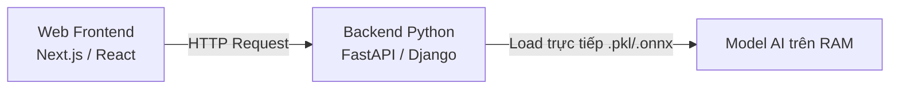
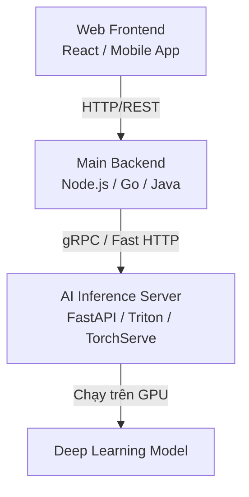
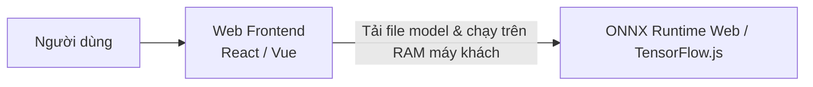

# Luồng Tích hợp Mọi Mô Hình AI lên Ứng dụng Web (Tổng quan Tất cả các Dòng Model)

Tài liệu này trình bày cách tích hợp thực tế của **tất cả các loại mô hình AI** (không chỉ Hồi quy mà gồm cả Phân loại, Thị giác máy tính, NLP/LLM và Hệ khuyến nghị) từ giao diện Web (Frontend) qua Backend đến mô hình AI để trả kết quả cho người dùng.

---

## 1. Bản đồ Kiến trúc Tích hợp AI trên Web (3 Mô hình Kiến trúc Phổ biến)

Tùy vào kích thước mô hình và yêu cầu phần cứng (CPU vs GPU), các kỹ sư hệ thống sẽ chọn một trong ba mô hình kiến trúc dưới đây:

### Kiến trúc A: Monolith (Trực tiếp)
*Dành cho mô hình gọn nhẹ (Scikit-learn, XGBoost, NLP nhỏ).*


### Kiến trúc B: Microservices (Tách biệt Server Inference) - Phổ biến nhất
*Dành cho mô hình nặng (Deep Learning, PyTorch, TensorFlow) cần chạy GPU.*


### Kiến trúc C: Client-Side Inference (Edge AI)
*Mô hình chạy trực tiếp trên trình duyệt của người dùng (không cần backend).*


---

## 2. Luồng xử lý chi tiết theo từng Nhóm Mô hình AI

Dưới đây là cách mà từng loại mô hình AI tiếp nhận dữ liệu từ Web Page, xử lý và hiển thị kết quả:

### Nhóm 1: Học máy truyền thống (Hồi quy & Phân loại - Tabular Data)
*Ví dụ: Dự đoán giá nhà (Hồi quy), Phân loại duyệt hồ sơ CV (Phân loại).*
*   **Dữ liệu truyền tải:** Dữ liệu dạng text/số dạng JSON qua body của API.
*   **Luồng xử lý:**
    ```
    Web Form (Nhập liệu) ──> POST JSON ──> Backend ──> Scaler (Chuẩn hóa) ──> Model Predict ──> Trả về Số/Nhãn phân loại
    ```
*   **Ví dụ:** Gửi thông tin ứng viên -> Trả về `{"duyet": true, "probability": 0.89}`.

---

### Nhóm 2: Thị giác Máy tính (Computer Vision - Hình ảnh/Video)
*Ví dụ: Nhận diện khuôn mặt, tìm kiếm bằng hình ảnh, OCR quét thông tin hóa đơn.*
*   **Dữ liệu truyền tải:** File ảnh vật lý (`.png`, `.jpg`) hoặc Stream Video camera. Thường gửi qua `Multipart/Form-Data` hoặc mã hóa `Base64`.
*   **Luồng xử lý:**
    1.  **Frontend:** Mở camera hoặc chọn file ảnh -> Gửi dữ liệu nhị phân (Binary data) lên Backend.
    2.  **Backend:** 
        *   Đọc file, resize ảnh về kích thước cố định mà mô hình yêu cầu (ví dụ: `224x224` hoặc `640x640`).
        *   Chuyển ảnh thành ma trận điểm ảnh (Pixel Array / Tensor) và chuẩn hóa độ sáng (chia cho `255.0`).
        *   Đưa vào mô hình Deep Learning (ví dụ: YOLO, ResNet).
    3.  **Kết quả trả về:** Tọa độ vật thể (Bounding Boxes) hoặc nhãn nhận diện kèm xác suất.
    4.  **Frontend render:** Vẽ khung hình vuông đè lên bức ảnh để khoanh vùng vật thể cho người dùng thấy.

---

### Nhóm 3: Xử lý Ngôn ngữ Tự nhiên & LLM (NLP/Generative AI)
*Ví dụ: Chatbot AI (ChatGPT style), tóm tắt văn bản, dịch thuật.*
*   **Dữ liệu truyền tải:** Chuỗi văn bản (String) và lịch sử cuộc trò chuyện (Conversation History).
*   **Luồng xử lý đặc thù (Streaming):** Do các mô hình ngôn ngữ lớn (LLM) mất thời gian suy luận dài, nếu đợi xử lý xong toàn bộ mới trả về sẽ gây cảm giác Web bị đơ. Vì vậy ta dùng cơ chế **Streaming (SSE - Server-Sent Events)**:
    ```
    Frontend (Gửi câu hỏi) ──> POST ──> Backend ──> Gọi API LLM (OpenAI/Gemini/Llama)
    Backend ──> Stream từng từ (Token) qua SSE ──> Frontend nhận liên tục và hiển thị chữ chạy (Typing effect)
    ```

---

### Nhóm 4: Hệ thống Khuyến nghị (Recommendation Systems)
*Ví dụ: Gợi ý việc làm phù hợp cho ứng viên trên trang tuyển dụng.*
*   **Dữ liệu truyền tải:** ID của người dùng (`user_id`), lịch sử click, tìm kiếm.
*   **Luồng xử lý (Thường chia làm 2 giai đoạn):**
    1.  **Giai đoạn 1: Offline (Huấn luyện ngầm):** Mô hình AI chạy định kỳ (mỗi giờ/mỗi ngày) quét qua toàn bộ database để tính toán trước các cặp gợi ý và lưu sẵn vào Cache/Database (Redis/MongoDB).
    2.  **Giai đoạn 2: Online (Khi User truy cập trang):**
        *   User load trang -> Frontend gửi `user_id`.
        *   Backend chỉ cần truy vấn nhanh từ Redis ra danh sách ID việc làm đã được tính sẵn cho User đó.
        *   Map thông tin việc làm và hiển thị lên UI trong vòng dưới 50ms.

---

## 3. Tổng hợp Bảng so sánh các kiểu Dữ liệu và Cách truyền tải

| Loại Mô hình AI | Dữ liệu đầu vào (Frontend -> Backend) | Kiểu truyền dữ liệu (Protocol / Format) | Cách xử lý đặc trưng ở Backend | Định dạng kết quả đầu ra (Backend -> Frontend) |
| :--- | :--- | :--- | :--- | :--- |
| **Tabular (Hồi quy / Phân loại)** | Số, chuỗi văn bản đơn giản nhập từ form | JSON (HTTP POST) | Chuẩn hóa đặc trưng (Scaler/Encoder) | JSON (Số thực hoặc Nhãn lớp) |
| **Thị giác Máy tính (CV)** | File ảnh, File video, URL ảnh | `multipart/form-data` hoặc Base64 | Đọc bằng OpenCV/Pillow, resize ảnh, chuyển thành NumPy Array/Tensor | JSON chứa danh sách vật thể, tọa độ `[x, y, w, h]` hoặc ảnh mới đã vẽ khung |
| **Generative AI / LLM** | Câu lệnh (Prompt), lịch sử chat | Server-Sent Events (SSE) hoặc WebSockets | Quản lý Context, kết nối Vector DB (RAG nếu cần), gọi LLM API | Stream từng từ (Chunks) |
| **Hệ khuyến nghị (RecSys)** | `user_id`, vị trí, ngành nghề quan tâm | JSON (HTTP GET/POST) | Đọc từ Cache kết quả đã tính sẵn (Offline recommendation) hoặc chạy thuật toán lọc cộng tác (Collaborative Filtering) | Mảng các IDs sản phẩm/bài viết/công việc gợi ý |

---

## 4. Luồng Xử lý Thực tế trên Dự án Hiện tại

Trong dự án của bạn, hệ thống được xây dựng theo mô hình **Microservices (Kiến trúc B)**, chia làm 2 phần độc lập:
1. **Frontend / Main Backend:** Chạy bằng **Next.js** (thư mục `recruitment-platform`, chạy ở port mặc định hoặc môi trường Node.js).
2. **AI Service Backend:** Chạy bằng **Django** (thư mục `SeverAI`, chạy ở cổng `127.0.0.1:8000`).

Dưới đây là chi tiết đường đi của dữ liệu qua từng file cho 3 tính năng AI chính của dự án:

---

### Tính năng 1: Gợi ý việc làm dựa trên CV (Chatbot AI & CV Recommender)

* **Trình duyệt (Client-side):** Người dùng tải lên file CV (PDF) hoặc chọn CV sẵn có từ giao diện Chatbot.
* **Next.js Route API ([chatbot/route.ts](file:///home/ngoan/Downloads/doanthu/recruitment-platform/app/api/public/chatbot/route.ts)):**
  1. Nhận file CV từ Frontend gửi lên dưới dạng `multipart/form-data`.
  2. Dùng `fetch` chuyển tiếp file hoặc `cv_text` sang API Django tại địa chỉ `http://127.0.0.1:8000/api/chatbot/recommend/`.
  3. Khi nhận danh sách ID việc làm gợi ý từ Django, Next.js truy vấn dữ liệu đầy đủ từ Database (qua Prisma `prisma.job.findMany()`) để trả về thông tin chi tiết (tên công ty, mức lương, địa điểm) cho Frontend render.
* **Django API Server ([views.py](file:///home/ngoan/Downloads/doanthu/SeverAI/api/views.py#L43-L92)):**
  1. Nhận yêu cầu tại hàm `chatbot_recommend_api`.
  2. Gọi `extract_text_from_pdf` (trong [chatbot.py](file:///home/ngoan/Downloads/doanthu/SeverAI/api/chatbot.py)) để trích xuất text thô từ file PDF gửi lên.
  3. Hàm `get_gemini_recommendations` (trong [chatbot.py](file:///home/ngoan/Downloads/doanthu/SeverAI/api/chatbot.py)) nhận text CV và gọi mô hình **Gemini API** để phân tích CV, khớp với các công việc trong Database và trả về danh sách ID công việc phù hợp kèm lý do phù hợp (`reason`).

---

### Tính năng 2: Chấm điểm độ tương thích CV và Tin tuyển dụng (Cross-Encoder Match Score)

* **Trình duyệt (Client-side):** Nhà tuyển dụng xem danh sách hồ sơ ứng tuyển và bấm "Chấm điểm/Đánh giá AI".
* **Next.js Route API ([evaluate/route.ts](file:///home/ngoan/Downloads/doanthu/recruitment-platform/app/api/employer/applications/%5Bid%5D/evaluate/route.ts)):**
  1. Nhận `application_id` từ Frontend.
  2. Ký bảo mật URL của file CV (`signCloudinaryCvUrl`).
  3. Gọi HTTP POST tới Django: `http://127.0.0.1:8000/api/evaluate-cv/`.
* **Django API Server ([views.py](file:///home/ngoan/Downloads/doanthu/SeverAI/api/views.py#L119-L188)):**
  1. Nhận dữ liệu tại hàm `evaluate_cv_api`.
  2. Tải xuống file CV từ URL của Cloudinary, trích xuất text CV bằng PyPDF2.
  3. Lấy thông tin tin tuyển dụng tương ứng (Tiêu đề, mô tả công việc, yêu cầu).
  4. Gọi hàm `calculate_match_score` (trong [cross_encoder.py](file:///home/ngoan/Downloads/doanthu/SeverAI/api/cross_encoder.py)) để truyền cả text CV và text tin tuyển dụng vào mô hình **Cross-Encoder** (sử dụng thư viện `sentence-transformers` trong Python).
  5. Mô hình tính ra độ tương quan ngữ nghĩa (Score từ 0 đến 100).
  6. Lưu trực tiếp điểm số này vào cột `matchscore` của bảng `Application` trong Database, sau đó phản hồi điểm số về Next.js.

---

### Tính năng 3: Gợi ý các việc làm tương tự (Job Recommendations - TF-IDF)

* **Trình duyệt (Client-side):** Người dùng đang xem chi tiết một tin tuyển dụng (ví dụ: Lập trình viên React).
* **Next.js Route API ([recommend/route.ts](file:///home/ngoan/Downloads/doanthu/recruitment-platform/app/api/public/jobs/%5Bslug%5D/recommend/route.ts)):**
  1. Lấy `job_id` của công việc hiện tại.
  2. Gọi HTTP GET tới Django: `http://127.0.0.1:8000/api/jobs/<job_id>/recommend/`.
  3. Nếu thành công, lấy danh sách công việc liên quan. Nếu thất bại (Server AI offline hoặc quá tải), Next.js tự động kích hoạt cơ chế dự phòng (fallback) để query các công việc cùng nhóm ngành (`categoryId`) trong database.
* **Django API Server ([views.py](file:///home/ngoan/Downloads/doanthu/SeverAI/api/views.py#L24-L41)):**
  1. Nhận yêu cầu tại hàm `recommend_jobs_api`.
  2. Gọi hàm `get_related_jobs` (trong [recommender.py](file:///home/ngoan/Downloads/doanthu/SeverAI/api/recommender.py)).
  3. Hàm này chạy thuật toán so khớp độ tương quan nội dung dựa trên **TF-IDF** (Term Frequency - Inverse Document Frequency) đã được tính toán từ các trường tiêu đề và mô tả công việc, tìm ra các công việc có độ tương đồng cosine (Cosine Similarity) cao nhất và trả về danh sách ID.
