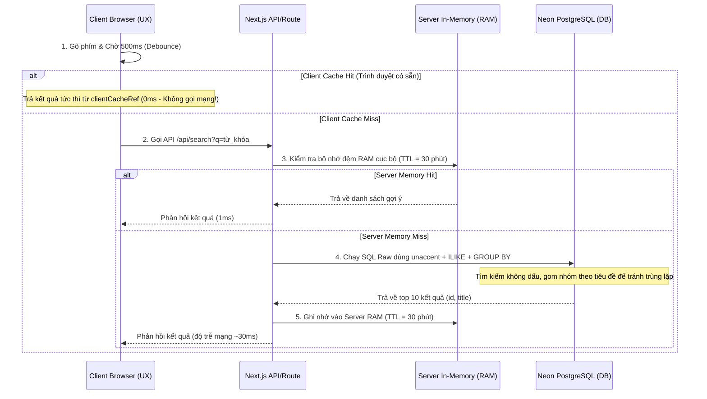

# Hướng dẫn Vận hành & Cấu trúc Gợi ý Tìm kiếm & Bộ lọc Thông minh (Smart Autocomplete & Filters)

Tính năng Gợi ý Tìm kiếm (Search Autocomplete/Suggestion) và các bộ lọc thông minh đã được tối ưu hóa toàn diện nhằm **loạt bỏ hoàn toàn việc tốn RAM trên server**, **tiết kiệm 100% tài nguyên Redis Cloud (Upstash)**, và phản hồi tức thì dưới **1ms** cho người dùng.

---

## 🏗️ 1. Cấu trúc Kiến trúc & Luồng đi của Dữ liệu mới



---

## 🛠️ 2. Các thành phần đã triển khai & Tối ưu hóa

### 1. Phía Server: API Gợi ý Tìm kiếm ([app/api/search/route.ts](file:///home/ngoan/doanthu/recruitment-platform/app/api/search/route.ts))
* **Dữ liệu gợi ý duy nhất (`GROUP BY title`)**: Gộp các công việc trùng tiêu đề (ví dụ: gộp nhiều job "Kế toán" thành 1 gợi ý duy nhất) giúp dropdown gọn gàng và chuyên nghiệp.
* **Loại bỏ mô hình AI cục bộ**: Vô hiệu hóa việc load `@xenova/transformers` trên Next.js giúp giải phóng ngay **~1.5GB RAM** của Server.
* **Bỏ qua Redis Cloud**: Vô hiệu hóa truy vấn Redis ở API gợi ý để tránh làm cạn kiệt gói quota 10k request/ngày của tài khoản Upstash.
* **Bộ nhớ đệm In-Memory cục bộ**: Lưu kết quả tìm kiếm trực tiếp trên RAM của tiến trình Node.js trong **30 phút**, tăng tốc phản hồi cho các từ khóa phổ biến lên **< 1ms**.
* **Tìm kiếm không dấu (`unaccent`)**: Người dùng gõ "ke toan" vẫn gợi ý chính xác "Kế toán".

### 2. Phía Giao diện: Hộp Tìm kiếm ([components/hero/SearchBox.tsx](file:///home/ngoan/doanthu/recruitment-platform/components/hero/SearchBox.tsx))
* **Client-side Caching**: Tích hợp bộ lưu trữ `clientCacheRef` trên JS của trình duyệt. Trình duyệt ghi nhớ các từ khóa người dùng vừa tìm kiếm trong cùng phiên làm việc.
* **Sửa lỗi Spinner bị kẹt**: Tự động tắt vòng tròn tải dữ liệu (`setLoading(false)`) ngay lập tức khi người dùng xóa sạch chữ hoặc khi lấy kết quả từ bộ nhớ đệm client.
* **Đè z-index giao diện**: Thiết lập `z-index: 20` trên SearchBox và `z-index: 10` trên Stats trong [components/hero/index.jsx](file:///home/ngoan/doanthu/recruitment-platform/components/hero/index.jsx) để hộp gợi ý luôn hiển thị nổi hoàn toàn bên trên các số liệu thống kê nền.

### 3. Trang Tìm việc chính ([app/jobs/page.tsx](file:///home/ngoan/doanthu/recruitment-platform/app/jobs/page.tsx))
* **Tích hợp Autocomplete gợi ý**: Thanh tìm kiếm tại trang tuyển dụng được nâng cấp logic gợi ý thông minh giống hệt trang chủ (Debounce, Client Cache).
* **Dropdown Khu vực theo DB**: Thay thế ô nhập text địa điểm tự do thành danh sách `<select>` dropdown tải trực tiếp dữ liệu từ bảng `Ward` trong DB.
* **Lọc "Công ty Hot" theo số lượt ứng tuyển**:
  * Bảng xếp hạng bên sidebar sắp xếp theo tổng lượt ứng tuyển (`appliesCount`) của các jobs đang hoạt động của công ty.
  * Khi click vào một công ty, trang web tự động áp dụng bộ lọc `company` trên URL để chỉ hiển thị các job của công ty đó, đồng thời hiển thị tag xóa bộ lọc nhanh ở đầu trang.

### 4. Tối ưu hóa Redis Client ([lib/redis.ts](file:///home/ngoan/doanthu/recruitment-platform/lib/redis.ts))
* **Bỏ qua hàng đợi khi offline (`disableOfflineQueue: true`)**: Nếu không khởi động Redis ở local (ECONNREFUSED), client sẽ ném lỗi ngay thay vì treo 10 giây để chờ kết nối, giúp hệ thống hoạt động mượt mà.
* **Tránh spam log**: Ẩn các dòng log báo lỗi `ECONNREFUSED` để giữ cho cửa sổ Terminal phát triển (development) luôn sạch sẽ.

---

## 🚀 3. Hướng dẫn Chạy & Kiểm tra

1. **Khởi chạy môi trường Next.js**:
   ```bash
   cd recruitment-platform
   npm run dev
   ```
2. **Kiểm tra trên trang chủ (`http://localhost:3000`)**:
   * Thử gõ các từ khóa có dấu/không dấu (ví dụ: `ke toan`, `kế toán`).
   * Gõ chữ và xóa nhanh bằng phím Backspace để kiểm tra spinner loading biến mất chính xác.
   * Dropdown gợi ý phải hiển thị đè lên trên các số liệu thống kê.
3. **Kiểm tra trên trang việc làm (`http://localhost:3000/jobs`)**:
   * Thanh tìm kiếm có gợi ý tương tự trang chủ.
   * Hộp chọn khu vực hiển thị đúng danh sách xã/phường từ DB.
   * Click vào công ty trong danh sách "Công ty Hot" ở sidebar bên trái để lọc danh sách job của công ty đó, và nhấn nút `x` trên tag bộ lọc ở đầu danh sách để hủy lọc.
