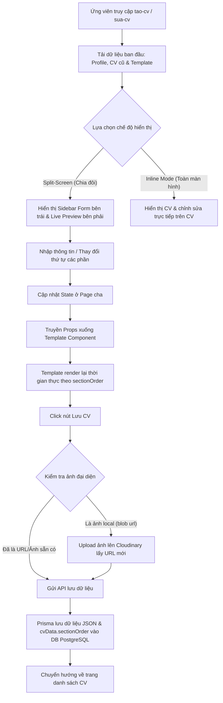
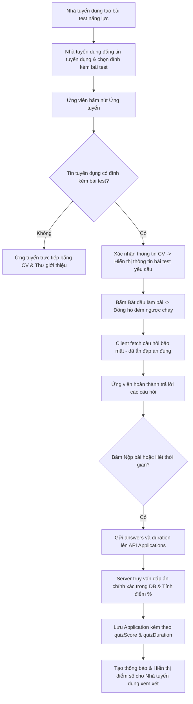
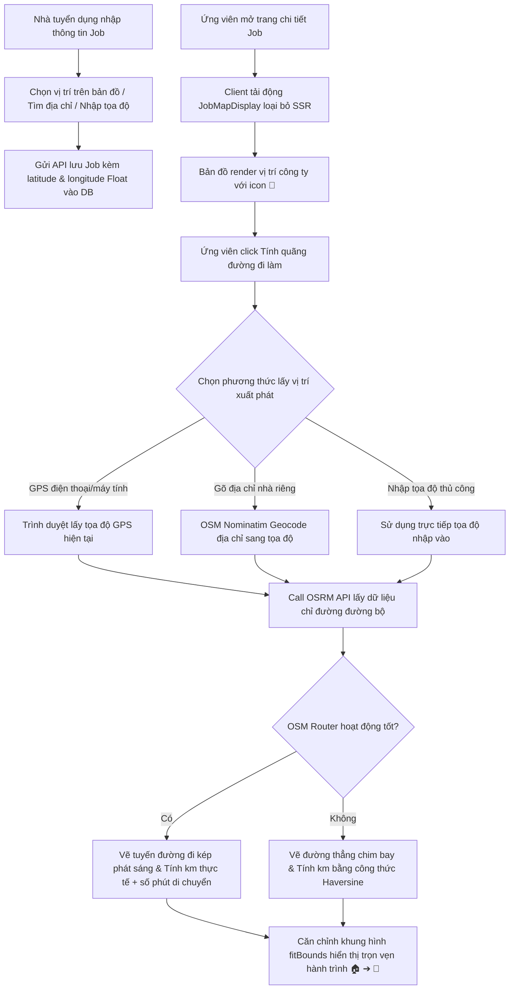

This is a [Next.js](https://nextjs.org) project bootstrapped with [`create-next-app`](https://nextjs.org/docs/app/api-reference/cli/create-next-app).

## Getting Started

First, run the development server:

```bash
npm run dev
# or
yarn dev
# or
pnpm dev
# or
bun dev
```

Open [http://localhost:3000](http://localhost:3000) with your browser to see the result.

You can start editing the page by modifying `app/page.tsx`. The page auto-updates as you edit the file.

This project uses [`next/font`](https://nextjs.org/docs/app/building-your-application/optimizing/fonts) to automatically optimize and load [Geist](https://vercel.com/font), a new font family for Vercel.

## Learn More

To learn more about Next.js, take a look at the following resources:

- [Next.js Documentation](https://nextjs.org/docs) - learn about Next.js features and API.
- [Learn Next.js](https://nextjs.org/learn) - an interactive Next.js tutorial.

You can check out [the Next.js GitHub repository](https://github.com/vercel/next.js) - your feedback and contributions are welcome!

## Deploy on Vercel

The easiest way to deploy your Next.js app is to use the [Vercel Platform](https://vercel.com/new?utm_medium=default-template&filter=next.js&utm_source=create-next-app&utm_campaign=create-next-app-readme) from the creators of Next.js.

Check out our [Next.js deployment documentation](https://nextjs.org/docs/app/building-your-application/deploying) for more details.
#   b a o c a o c h u n g  
 #   j o b p q n v s m t  

## Tính năng mới: Trình tạo & Chỉnh sửa CV chia màn hình (CV Builder)

Nền tảng đã được nâng cấp hệ thống thiết kế CV chuyên nghiệp, hỗ trợ tương tác chia đôi màn hình (Split-Screen) thời gian thực và quản lý thứ tự các mục lớn linh hoạt.

### Các thành phần chính:
- **Sidebar Form (Bên trái)**: Cho phép nhập liệu trực quan theo từng phần (Thông tin liên hệ, Về tôi, Học vấn, Kinh nghiệm, Dự án, Ngôn ngữ & Kỹ năng).
- **Xem trước thời gian thực (Bên phải)**: Render mẫu CV (A4 Sheet) tức thì khi người dùng đang nhập liệu.
- **Quản lý thứ tự (`SectionOrderManager`)**: Cho phép sắp xếp thứ tự hiển thị của các phần lớn (Học vấn, Dự án, Kinh nghiệm...) bằng các nút mũi tên, dữ liệu được lưu động vào thuộc tính `sectionOrder` trong trường `cvData`.

### Luồng Dữ liệu & Hoạt động (Data Flow)



## Tính năng mới: Bài kiểm tra năng lực trực tuyến (Online Assessment / Skill Quiz)

Tính năng này giúp nhà tuyển dụng dễ dàng đánh giá trình độ chuyên môn của ứng viên thông qua các bài trắc nghiệm trực tuyến có giới hạn thời gian đi kèm với tin tuyển dụng.

### Các thành phần chính:
- **Quản lý bài test (Employer)**: Nhà tuyển dụng có thể tạo mới, chỉnh sửa, xóa các đề thi trắc nghiệm (soạn câu hỏi, các đáp án lựa chọn và đáp án đúng) cùng với thiết lập giới hạn thời gian (phút).
- **Đính kèm bài test vào tin tuyển dụng**: Khi đăng tin (`JobForm`), nhà tuyển dụng có quyền chọn đính kèm một bài test năng lực (hoặc bỏ trống nếu không muốn làm test).
- **Giao diện làm bài trắc nghiệm (Candidate)**: Ứng viên làm bài trong thời gian quy định với đồng hồ đếm ngược thời gian thực (Countdown Timer), giao diện chuyển câu hỏi linh hoạt, hỗ trợ lưu đáp án tạm thời và tự động nộp bài khi hết giờ.
- **Server-side Validation & Chấm điểm**: Kết quả thi được gửi lên server và chấm điểm trực tiếp tại API để bảo mật (tránh rò rỉ đáp án đúng ở client). Hệ thống lưu điểm (%) và thời gian làm bài vào bảng `Application`.
- **Xem kết quả ứng tuyển**: Hiển thị trực quan điểm test tại danh sách ứng tuyển của Employer giúp lọc nhanh ứng viên xuất sắc.

### Luồng Dữ liệu & Hoạt động (Data Flow)



## Tính năng mới: Bản đồ Định vị tuyển dụng & Tính quãng đường đi làm (Leaflet.js & OpenStreetMap)

Tính năng này tích hợp bản đồ tương tác mã nguồn mở (100% miễn phí) giúp nhà tuyển dụng định vị cơ sở làm việc chính xác và hỗ trợ ứng viên ước tính quãng đường, lộ trình di chuyển thực tế.

### Các thành phần chính:
- **Định vị điểm tuyển dụng (Employer)**: Nhà tuyển dụng có thể ghim địa điểm làm việc trên bản đồ khi tạo/sửa tin tuyển dụng thông qua:
  - Tìm kiếm nhanh bằng địa chỉ văn phòng (Nominatim API).
  - Nhấp chuột trực tiếp lên bản đồ hoặc kéo thả Marker.
  - Tự nhập tọa độ vĩ độ (Latitude) và kinh độ (Longitude) thủ công.
- **Bản đồ chi tiết công việc (Candidate)**: Hiển thị ghim văn phòng công ty tuyển dụng dạng icon **🏢 (Office)** bắt mắt trên nền bản đồ tối giản CartoDB Positron.
- **Tính quãng đường đi làm (Commute Calculator)**: Ứng viên có thể bấm nút mở rộng công cụ tính khoảng cách từ nhà đến nơi làm việc bằng cách:
  - Lấy GPS hiện tại từ trình duyệt (`navigator.geolocation`).
  - Gõ địa chỉ nhà riêng hoặc tự điền tọa độ thủ công.
- **Vẽ hành trình thực tế (Glowing Route Path)**: Hệ thống gọi API định tuyến miễn phí OSRM để vẽ đường đi thực tế dưới dạng **đường viền phát sáng Glowing Route** nối từ vị trí ứng viên **🏠 (Home)** đến nơi làm việc **🏢 (Office)**, đồng thời hiển thị khoảng cách lái xe (km) và thời gian di chuyển dự kiến (phút).
  - *Tốc độ tính toán*: OSRM sử dụng tốc độ định tuyến đường bộ thực tế dựa trên phân loại đường của Phú Quốc (trục chính ĐT45/ĐT47: 50-60 km/h; nội thị Dương Đông/An Thới: 30-40 km/h; đường dân sinh nhỏ: 15-25 km/h).
- **Cơ chế dự phòng (Fallback)**: Nếu dịch vụ OSRM không phản hồi, bản đồ sẽ tự vẽ đường thẳng (đường chim bay) và tính khoảng cách theo công thức lượng giác Haversine để đảm bảo trải nghiệm không bị gián đoạn.
  - *Thời gian dự phòng*: Nếu OSRM bị ngắt kết nối, hệ thống sẽ sử dụng tốc độ xe máy trung bình trên đảo là **40 km/h** để ước lượng thời gian đi làm dự phòng.

### Luồng Dữ liệu & Hoạt động (Data Flow)

