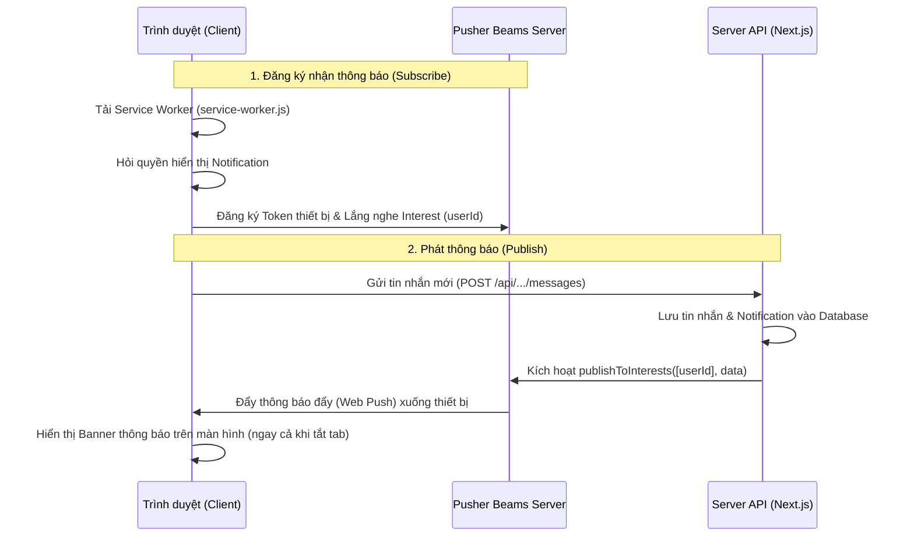

# Nhật ký Thay đổi Tích hợp Real-time bằng Pusher Beams

Tài liệu này ghi lại toàn bộ các file được thêm mới, chỉnh sửa và cấu hình trong quá trình tích hợp Pusher Beams để tối ưu hóa hiệu năng và thay thế cơ chế HTTP Polling 5s cũ.

---

## 1. Cấu hình Môi trường (`.env`)
Thêm các biến cấu hình kết nối Pusher Beams để hệ thống xác thực và gửi thông báo đẩy:
```env
# Pusher Configuration
NEXT_PUBLIC_PUSHER_BEAMS_INSTANCE_ID="9369d0ac-b945-4f2e-bc0b-7f22441a3941"
PUSHER_BEAMS_SECRET_KEY="C26480549639DD46AE5DDE7F5F470238956BE962B9D270CDBDAB6263B797A9F4"
```

---

## 2. File Mới Thêm Vào Dự Án

### `public/service-worker.js`
Đăng ký nhận dịch vụ đẩy thông báo ngầm từ Pusher trên trình duyệt:
```javascript
importScripts("https://js.pusher.com/beams/service-worker.js");
```

### `lib/pusher-beams.ts` (Backend SDK)
Khởi tạo kết nối Pusher Beams phía Server dùng để đẩy thông báo realtime:
```typescript
import PushNotifications from '@pusher/push-notifications-server';

const beamsClient = new PushNotifications({
  instanceId: process.env.NEXT_PUBLIC_PUSHER_BEAMS_INSTANCE_ID || '',
  secretKey: process.env.PUSHER_BEAMS_SECRET_KEY || '',
});

export default beamsClient;

export async function sendPushNotification(userId: string, title: string, body: string, deepLink?: string) {
  try {
    await beamsClient.publishToInterests([userId], {
      web: {
        notification: {
          title,
          body,
          deep_link: deepLink || undefined,
        },
      },
    });
    console.log(`Push notification sent successfully to user ${userId}`);
  } catch (error) {
    console.error('Failed to send push notification via Pusher Beams:', error);
  }
}
```

### `lib/pusher-beams-client.ts` (Frontend SDK)
Singleton khởi tạo Pusher Beams client ở trình duyệt:
```typescript
import * as PusherPushNotifications from '@pusher/push-notifications-web';

let beamsClient: any = null;

export const getBeamsClient = () => {
  if (typeof window === 'undefined') return null;
  if (!beamsClient) {
    beamsClient = new PusherPushNotifications.Client({
      instanceId: process.env.NEXT_PUBLIC_PUSHER_BEAMS_INSTANCE_ID || '',
    });
  }
  return beamsClient;
};
```

### `components/PusherBeamsInitializer.tsx` (Component Đăng ký thiết bị)
Lắng nghe khi người dùng đăng nhập thành công, tự động yêu cầu quyền gửi thông báo (`Notification.requestPermission`) và đăng ký thiết bị theo User ID của họ:
```tsx
'use client';

import { useEffect } from 'react';
import { getBeamsClient } from '@/lib/pusher-beams-client';

interface PusherBeamsInitializerProps {
  userId: string;
}

export default function PusherBeamsInitializer({ userId }: PusherBeamsInitializerProps) {
  useEffect(() => {
    if (!userId) return;

    const beamsClient = getBeamsClient();
    if (!beamsClient) return;

    beamsClient.start()
      .then(() => beamsClient.addDeviceInterest(userId))
      .then(() => console.log('Successfully registered and subscribed to Beams interest: ' + userId))
      .catch((err: any) => console.error('Pusher Beams initialization error:', err));
  }, [userId]);

  return null;
}
```

---

## 3. Các File Đã Thay Đổi/Chỉnh Sửa (Modify)

### `components/candidate/CandidateShell.tsx`
Tích hợp component khởi tạo Pusher Beams vào giao diện của ứng viên:
* Thêm import: `import PusherBeamsInitializer from "@/components/PusherBeamsInitializer";`
* Render `<PusherBeamsInitializer userId={user.id} />` ngay khi thông tin người dùng được tải về thành công.

### `components/employer/EmployerShell.tsx`
Tích hợp component khởi tạo Pusher Beams vào giao diện của nhà tuyển dụng:
* Thêm import: `import PusherBeamsInitializer from '@/components/PusherBeamsInitializer';`
* Lưu giữ state `userId` lấy từ API `/api/auth/me`.
* Render `<PusherBeamsInitializer userId={userId} />` trong layout.

### `app/api/candidate/conversations/[id]/messages/route.ts`
Kích hoạt gửi push notification đến nhà tuyển dụng khi ứng viên gửi tin nhắn mới:
* Thêm import `sendPushNotification`.
* Gọi hàm `sendPushNotification(conv.employerId, ...)` sau khi lưu tin nhắn thành công.

### `app/api/employer/conversations/[id]/messages/route.ts`
Kích hoạt gửi push notification đến ứng viên khi nhà tuyển dụng trả lời tin nhắn:
* Thêm import `sendPushNotification`.
* Gọi hàm `sendPushNotification(conv.candidateId, ...)` sau khi lưu tin nhắn thành công.

---

## 4. Cơ Chế Hoạt Động (How it works)

Hệ thống hoạt động theo mô hình Pub/Sub (Publish/Subscribe) thông qua server trung gian của Pusher Beams:



### Chi tiết các bước:
1. **Lắng nghe & Đăng ký (Subscribe)**:
   * Khi người dùng (Ứng viên hoặc Nhà tuyển dụng) đăng nhập thành công vào hệ thống, component `PusherBeamsInitializer` sẽ khởi tạo kết nối.
   * `beamsClient` kích hoạt Service Worker (`service-worker.js`) chạy ngầm dưới trình duyệt của Client.
   * Trình duyệt yêu cầu người dùng cấp quyền nhận thông báo. Khi được đồng ý, thiết bị này sẽ đăng ký một kênh lắng nghe (Interest) duy nhất chính là `userId` của họ trên Pusher Beams Server.
2. **Gửi tin nhắn & Kích hoạt thông báo (Publish)**:
   * Người dùng A gửi một tin nhắn đến người dùng B qua API POST.
   * Server Next.js sau khi lưu tin nhắn vào CSDL sẽ lấy `userId` của người dùng B làm Target Interest.
   * Server gọi hàm `publishToInterests([userId], ...)` gửi yêu cầu đẩy thông báo đến Pusher Beams Server kèm theo nội dung tin nhắn và đường dẫn mở nhanh (`deep_link`).
3. **Đẩy thông báo xuống Client**:
   * Pusher Beams Server sẽ tìm tất cả các thiết bị/trình duyệt đang đăng ký Interest `userId` đó và đẩy thông báo xuống thông qua giao thức Web Push của trình duyệt (Chrome, Safari, Firefox).
   * Service Worker nhận dữ liệu và hiển thị popup thông báo trực tiếp lên góc màn hình hệ điều hành của người nhận. Khi click vào thông báo sẽ tự động mở đúng trang chat tương ứng.

