# Luồng Xử Lý Xác Thực Google Login (OAuth 2.0)

Tài liệu này mô tả chi tiết quy trình đăng nhập bằng tài khoản Google được thiết kế riêng cho nền tảng Tuyển dụng, tích hợp mượt mà với cơ chế JWT Cookie hiện tại.

---

## 1. Sơ đồ tuần tự (Sequence Diagram)

Dưới đây là mô hình hoạt động giữa Trình duyệt (Client), Next.js Backend API, Google Identity Service và Database (Prisma / PostgreSQL):

```mermaid
sequenceDiagram
    autonumber
    actor User as Người dùng
    participant Client as Trình duyệt (Frontend)
    participant RouteInit as API /api/auth/google
    participant Google as Google OAuth Server
    participant RouteCallback as API /api/auth/google/callback
    participant DB as Database (Prisma)

    User->>Client: Click nút "Tiếp tục với Google"
    Client->>RouteInit: Chuyển hướng trình duyệt
    Note over RouteInit: 1. Tạo CSRF state ngẫu nhiên<br/>2. Lưu state vào Cookie (oauth_state)<br/>3. Tạo URL xác thực của Google
    RouteInit-->>Client: Chuyển hướng tới Google Consent Screen
    Client->>Google: Hiển thị giao diện đăng nhập Google
    User->>Google: Xác thực tài khoản Google thành công
    Google-->>Client: Chuyển hướng về Callback URL kèm 'code' và 'state'
    Client->>RouteCallback: GET /api/auth/google/callback?code=xxx&state=yyy
    
    rect rgb(20, 30, 40)
        Note over RouteCallback: Kiểm tra State chống tấn công CSRF
        RouteCallback->>RouteCallback: So sánh 'state' từ URL với Cookie 'oauth_state'
    end

    RouteCallback->>Google: POST /oauth2/v2/token (Gửi code, client_id, secret)
    Google-->>RouteCallback: Trả về access_token & id_token
    RouteCallback->>Google: GET /userinfo (Gửi kèm access_token)
    Google-->>RouteCallback: Trả về Profile (email, name, picture)
    
    RouteCallback->>DB: Truy vấn user bằng email
    alt User chưa tồn tại trong hệ thống
        RouteCallback->>DB: Tạo mới User (Vai trò mặc định: CANDIDATE, mật khẩu ngẫu nhiên)
        DB-->>RouteCallback: Trả về User mới
    else User đã tồn tại
        Note over RouteCallback: Kiểm tra trạng thái hoạt động (isActive/isLocked)
        RouteCallback->>DB: (Tùy chọn) Cập nhật avatar nếu trống
    end

    Note over RouteCallback: Tạo JWT Token bằng thư viện jose (chứa id, name, role)
    RouteCallback-->>Client: Thiết lập HttpOnly Cookie "token" & Chuyển hướng về trang chủ "/"
    Client->>User: Hiển thị trạng thái đã Đăng nhập thành công!
```

---

## 2. Chi tiết luồng xử lý kỹ thuật

### Bước 1: Khởi tạo luồng đăng nhập (`/api/auth/google`)
- **Nhiệm vụ**: Sinh ra URL chuyển hướng sang Google và chuẩn bị mã bảo mật để chống giả mạo request.
- **Xử lý**:
  1. Đọc `GOOGLE_CLIENT_ID` từ biến môi trường.
  2. Tạo mã `state` ngẫu nhiên thông qua `crypto.randomUUID()`.
  3. Tự động nhận diện tên miền đang chạy (Dynamic Host & Protocol) để cấu hình chính xác tham số `redirect_uri`.
  4. Đính kèm `oauth_state` vào HttpOnly Cookie với thời gian sống 10 phút.
  5. Chuyển hướng người dùng sang liên kết xác thực của Google.

### Bước 2: Nhận phản hồi & Đăng nhập (`/api/auth/google/callback`)
- **Nhiệm vụ**: Xử lý kết quả từ Google trả về, xác thực danh tính người dùng và thiết lập phiên làm việc (Session).
- **Xử lý**:
  1. Kiểm tra tham số `state` nhận được từ URL có khớp hoàn toàn với `oauth_state` lưu trong cookie không. Nếu không khớp hoặc thiếu, từ chối ngay lập tức để chặn tấn công **CSRF**.
  2. Gửi request dạng POST để trao đổi mã xác thực `code` lấy `access_token` từ Google API.
  3. Dùng `access_token` gửi yêu cầu lấy thông tin người dùng bao gồm: **Email, Tên hiển thị, Ảnh đại diện**.
  4. Tra cứu cơ sở dữ liệu:
     - **Tài khoản mới**: Hệ thống tự tạo tài khoản dạng **CANDIDATE (Ứng viên)** với một mật khẩu ngẫu nhiên được mã hóa bằng `bcrypt` (nhằm thỏa mãn ràng buộc bắt buộc mật khẩu của DB schema).
     - **Tài khoản cũ**: Kiểm tra xem tài khoản có bị khóa (`isLocked === true` hoặc `isActive === false`) không. Nếu bị khóa, sẽ chuyển hướng về `/login` kèm thông báo lỗi cụ thể.
  5. Ký mã hóa (Sign) chuỗi JWT token chứa `{ id, name, role }` sử dụng thư viện `jose` và mã khóa bí mật `JWT_SECRET`.
  6. Lưu JWT token vào HttpOnly Cookie tên là `token` (SameSite: Strict, an toàn tuyệt đối chống tấn công XSS và CSRF).
  7. Xóa cookie `oauth_state` tạm thời và chuyển hướng người dùng về trang chủ.

---

## 3. Các cơ chế bảo mật nổi bật

* **State Token (Chống CSRF)**: Ngăn chặn kẻ xấu lừa người dùng click vào các liên kết đăng nhập giả mạo.
* **HttpOnly & Secure Cookies**: Token phiên đăng nhập (`token`) được truyền qua cookie với cờ `httpOnly` nhằm đảm bảo các script chạy ở Frontend (JS) không thể đọc được, triệt tiêu nguy cơ bị đánh cắp session qua lỗi XSS.
* **Mã hóa mật khẩu**: Tài khoản Google đăng ký mới tự động tạo mật khẩu phức tạp ngẫu nhiên 36 ký tự và được băm bằng thuật toán `bcrypt` trước khi lưu vào DB.
